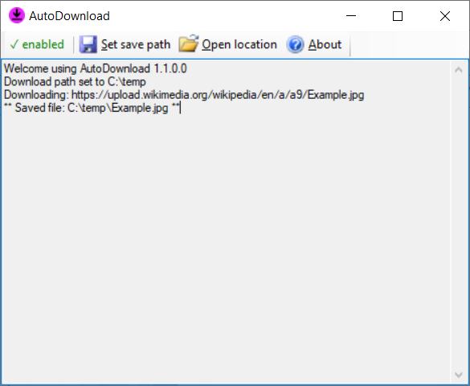

# AutoDownload

AutoDownload is a simple utility that will monitor your clipboard. Whenever your clipboard contents change and if the content is recognized as an URL, AutoDownload will automatically download the file from the URL if possible. AutoDownload is not a full fledged download manager, but often gets the job done.
